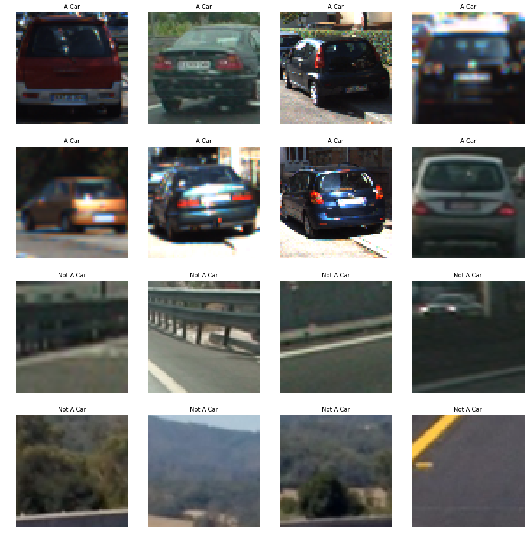
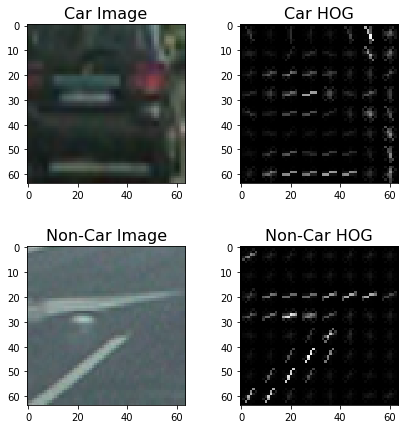
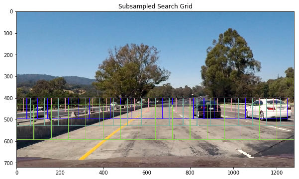
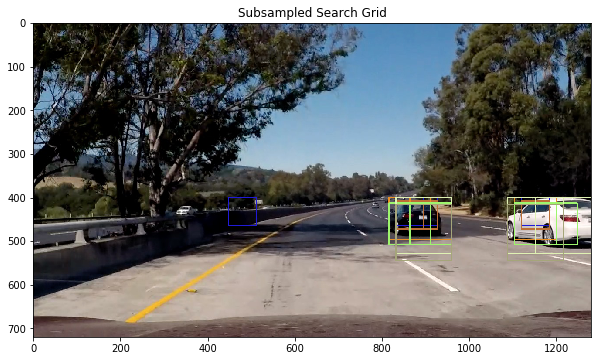
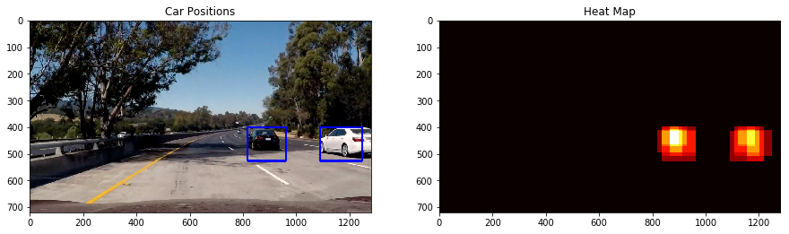
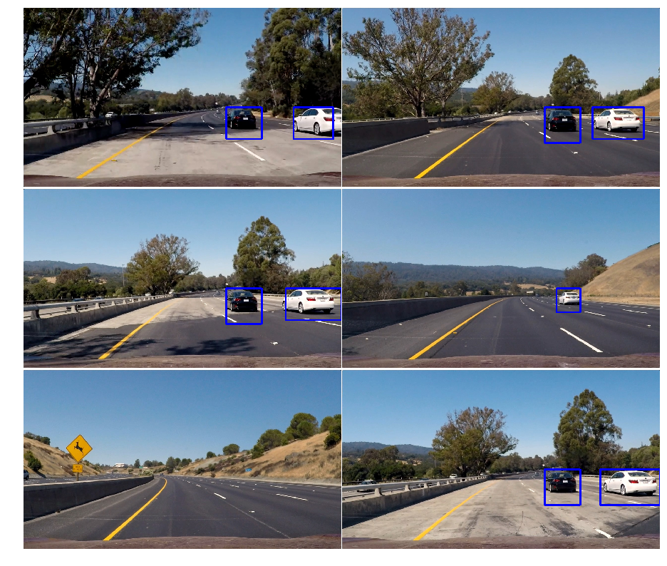

# Vehicle Detection

The goal of this project is following:
* Perform feature extraction from training dataset of car and non-car images for detecting cars using machine learning approach
* Use the extracted feature to train a binary classifier (either SVM or Decision Tree) that output whether or not a car is present in an input image
* Ensure that the pipeline eliminates false-positives
* Run the algorithm on a given test video to verify its performance

The Project
---

**Training Data Exploration**
First, following the rite of passage for any machine learning project, I explored the training dataset. Here are some examples of the images that are taken fro GTI vehicle image database and KITTI vision benchmark suite:

The training data had roughly an equal split (8792 vs 8968 between car and non-car images). Based on these numbers, I decided that I do not have to perform any data augmentation to ensure that I have a balanced dataset.

Then I explored the HOG features of car and non-car images:

For parameters, I settled the following HOG paramters: `orientations=11`, `pixel_per_cell=(16,16)`, `cells_per_block=(2,2)`. With 11 orientations I had more bins to characterize the edges of each training image. I found that 16 pixels is enough to capture the signficant edge characteristics of any car. I avoided setting the value too low because that would capture fluctations due to noise or lighting variations in the image. I found that more cells per block did not quite help classification. My guess is that there is loss of spatial resolution if we try to squeeze in more cells per block, resulting in larger area to cover for normalization.

**Training Car Classifier**
I chose to train a linear SVM which is a popular choice for binary classification tasks. The linear SVM tended to perform better when HOG features were concatenated with spatial and colour features. I went through an iterative process to settle with parameters that worked the best. I ended up usng YUV channel for color feature extraction because it gave me the best performance for classification. I designated 20% of the dataset for test purpose and rest for the training. My SVM classifier in the end had 99.27% accuracy when tested against the test dataset.

**Sliding Window Search**
I settled with the method of subsampling a precomputed HOG features for a given input image. After setting up the pipeline for sliding window search at varying spatial scale, I had to pick which starting y and ending y locations to use to increase the probability of detecting car in a camera projected view. It was just a matter of performing an iterative procedure to find the best combination of spaital scales along with the starting y and ending y locations while visualizing the search grid pattern:

After some optimization I ended up with following result:

Towards Video Output
---
**Heat Map For Rejecting False Positives**
Having search grid at multiple scale allowed me to produce heat map. The heat map allowed the pipeline to be robust against false positives by capturing any overalpping of positive detections that happen over a certain region of the input image. The consensus of detection at multiple spatial scales heleps the pipeline to be more confident about output. Here is an example of heat map generated detection:

**Pipeline Test**
After implementing all the pieces of puzzle for the entire pipeline, I tested on the given test images:

Here is the link to my output video:
[link to my video result](./project_video_output.mp4)

Discussion
---
The pipeline does fairly well on the given project video. However, the car in the video is travelling under very stable lighting conditions. Also, there are only two cars with unique colors during the entire span of the video. As a result, it is not a fair test to see if the pipeline is robust against against all kinds of driving conditions. Moreover, sometimes the bounding box disappears due to false negatives. This may be improved with a temporal filter, where we track the trajectory of the car in a projected space. We could even unwarp the projection as per our last lesson to make trajectory tracking easier.
